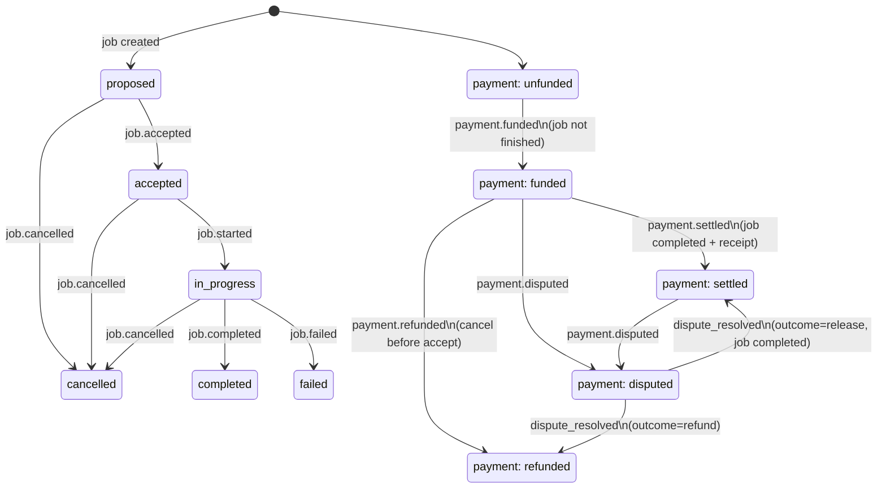

# Job-Acceptance vs Payment-Finality State Machine (200-hard-tasks #5)

Job state and payment state are **separate dimensions**. A job can be
accepted before it is funded; funding does not imply acceptance; completion
does not imply settlement. Every cross-dimension rule is explicit in
`server/job-payment-state.mjs` (`applyEvent`).

## State diagram

## Transition table (cross-dimension rules)

| event | from (job, payment) | to | guard |
|---|---|---|---|
| job.accepted | (proposed, *) | (accepted, *) | — |
| job.started | (accepted, *) | (in_progress, *) | — |
| job.completed | (in_progress, *) | (completed, *) | — |
| job.failed | (in_progress, *) | (failed, *) | — |
| job.cancelled | (not completed, *) | (cancelled, *) | cannot cancel a completed job |
| payment.funded | (proposed\|accepted\|in_progress, unfunded) | (*, funded) | integer-string amountRaw required |
| payment.settled | (completed, funded) | (completed, settled) | **settlement receipt required** (task #4), receipt.jobId must match |
| payment.disputed | (*, funded\|settled) | (*, disputed) | reason required |
| payment.dispute_resolved | (*, disputed) | (*, settled\|refunded) | outcome release→settled needs job completed |
| payment.refunded | (*, funded\|disputed) | (*, refunded) | reason required |

## Duplicate-event dedup

Every event carries an `eventId`. `applyEvent` keeps `seenEvents`; a repeat
`eventId` returns `{ record, deduped: true }` with the record unchanged — the
eventId wins over payload differences. This is the exactly-once
application layer the idempotency design (task #3) builds on.

## Worked flows

- **accept → settle:** fund → accept → start → complete → settle+receipt → terminal.
- **accept → dispute:** fund → accept → dispute → resolve(refund) → terminal.
- **fund → cancel → refund:** fund → cancel (before accept) → refund → terminal.
- **dispute after settle:** fund → … → settle → dispute → resolve(release) → settled.

Terminal states: `settled`, `refunded` (`isTerminal()`).
