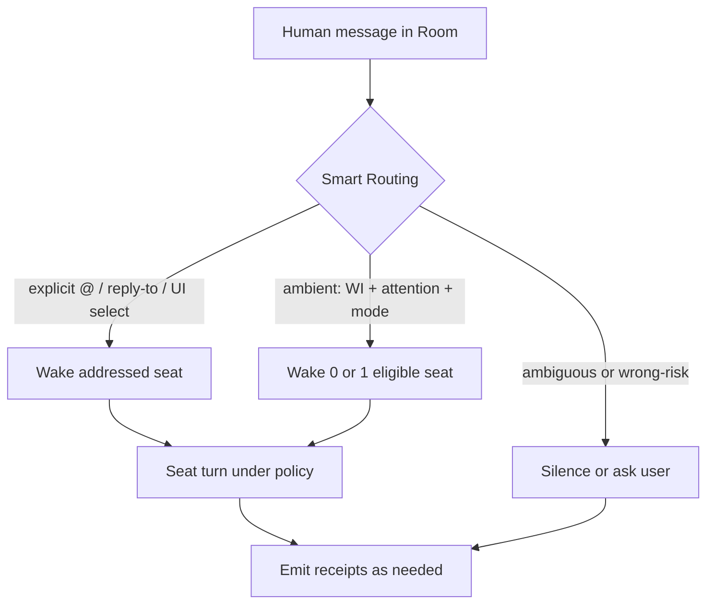
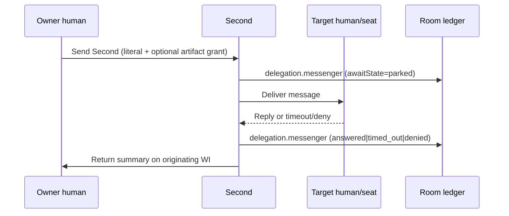
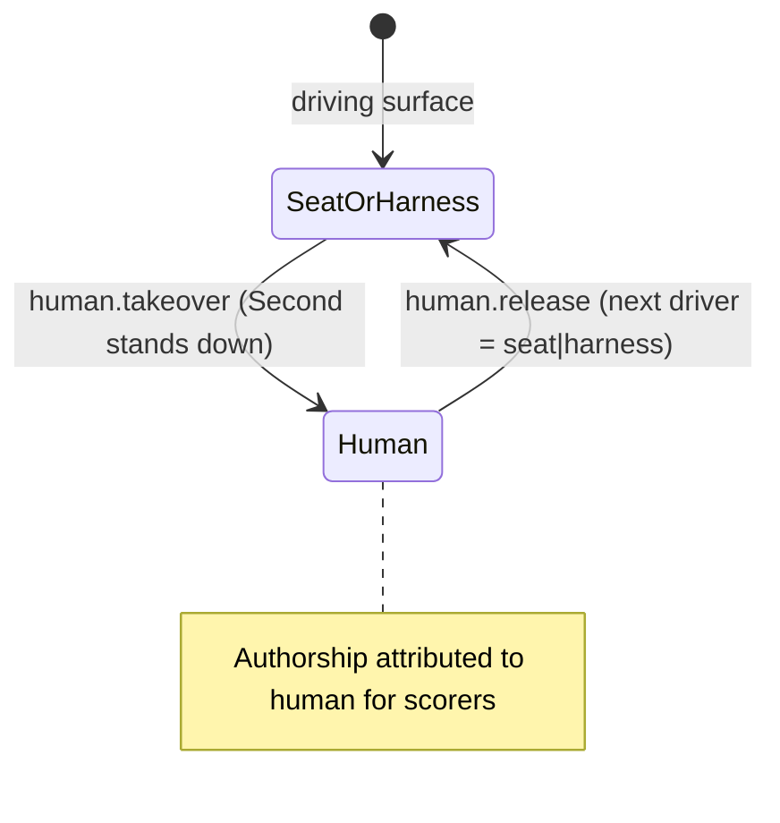
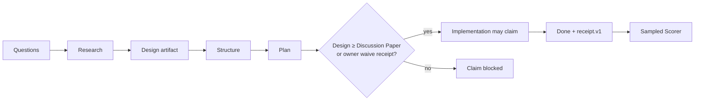

# Project Room — Cohesive Architecture (Ledger Room)

**Dated research brief:** 2026-09-17 PT  
**Canonical SoR:** [docs/ROOM-COHESIVE-ARCHITECTURE.md](../docs/ROOM-COHESIVE-ARCHITECTURE.md)  
**Product personal agent:** **Second** (never Genie in product copy, onboarding, or marketing examples)  
**Audience:** Potter · Instinct · Muse (docs only — no Muse UI code in this pass)

This file is the dated research copy of the architecture SoR. Prefer
[docs/ROOM-COHESIVE-ARCHITECTURE.md](../docs/ROOM-COHESIVE-ARCHITECTURE.md)
when deciding what ships and what does not. Same-rung spawn / Jev
rung / `delegation.spawn` fold:
[ROOM-JEV-CODEX-SPAWN-STEAL-2026-09-17.md](ROOM-JEV-CODEX-SPAWN-STEAL-2026-09-17.md).

This document collapses the steal stack into **one** product. Prefer it over scattered synthesis notes when deciding what ships and what does not.

---

## 0. One-page thesis

**Project Room is the accountability ledger for humans and BYO agents.**

Chat is a projection. Compute is a supplier. Desktops and specialist harnesses are evidence devices. Scorers are auditors. **Second** is each human’s loyal front door. The Room ledger is the system of record (SoR).

| Layer | Owns |
| --- | --- |
| **Room ledger** | Work Items, Artifacts, Receipts (graph), membership, scorers |
| **Second** | Smart Routing, disclosure, messenger, progressive tool selection, human handoff |
| **Connect** | One surface: Wake · Pull · Desktop · Takeover |
| **Specialists** | CUA / Codex / Claude Code / browser / shell — invoked under policy, not co-equal personal agents |
| **Capacity** | Honest leases + host/provider limits (selection ≠ authority) |
| **Personas / factory** | How `room` seats spawn and claim Work Items |
| **Synthesis seat** | Cross–Work Item integration only — never a second personal agent |

**Differentiation:** seats with explicit axes, Work Items with receipt graphs, design-bound implement, scorers that propose kit PRs (human merge). Not an IDE, not an events third-space, not a crew framework, not a Slack bot with a coat of paint.

---

## 1. Collapse map (already agreed)

| # | Keep as | Absorbs / replaces |
| --- | --- | --- |
| 1 | **Second** = personal seat | Loyalty + disclosure/Secretary; not a mascot product |
| 2 | **Connect** = one attention+execution surface | Wake / Pull / Desktop / Takeover — not four products |
| 3 | **Receipt graph** | Messenger, takeover, `disclosure.deny`, Trust Handoff citations |
| 4 | **Scorers + RPI gate** | Accountability loop + design-bound implement |
| 5 | **Capacity** | Progressive tool leases + host/provider honesty |
| 6 | **Specialists under Second** | CUA/Codex/Claude coordinated; ledger = SoR |
| 7 | **Personas/factory + Synthesis** | Room-seat spawn path; synthesis ≠ personal agent |

---

## 2. Object model

### 2.1 Core objects

| Object | Kind | One-line |
| --- | --- | --- |
| **Human** | Actor | Room member; owns exactly one Second |
| **Second** | Seat (`seat.kind=personal`) | Durable loyal front-door agent; disclosure-aware |
| **Room seat** | Seat (`seat.kind=room`) | Mission-scoped worker spawned via personas/factory |
| **Synthesis seat** | Seat (`seat.kind=synthesis`) | Cross–Work Item integrator; never orphan claims |
| **Work Item / Mission Envelope** | Ledger unit | Goal + personas + stewards + artifacts + receipt_graph + maturity + scores |
| **Artifact** | Durable work | design.md, plan, PR, screenshot, memo — maturity ladder |
| **Receipt** | Typed event (`room.receipt.v1`) | Evidence node; cites prior envelopes; no secrets in `summary` |
| **Scorer** | Auditor persona/kit | One dimension; sampled; self-improve → human-merge PR only |
| **Connect session** | Attention+execution bind | Wake / Pull / Desktop / Takeover on one enrolled host or packet |

### 2.2 Seat axes (never collapse into one “bot” badge)

1. **identity** — who  
2. **membership** — may be in this Room  
3. **authority** — what actions allowed (discovery ≠ execution)  
4. **attention** — when to wake (`all` | `mentions` | `none` / pull)  
5. **memory** — private owner scopes + Room namespaces  
6. **presence** — online / away / quiet / catchup  
7. **disclosure** — Secretary: what Second may say to whom (`disclosure.deny` when blocked)

Changing an axis is a **logged receipt event** (permission drift is scorable).

### 2.3 Work Item as Mission Envelope

```
Work Item
  personas[]        # foreman | triage | implementation | review | scorer
  stewards{}        # Summary / Source / Cross-link / Action / Risk
  artifacts[]       # design, plan, PR, screenshot, Synthesis Memo
  receipt_graph     # DAG: later receipts cite earlier receipt ids
  maturity          # Artifact Maturity Ladder rung
  scores[]          # Scorer classifications on Done samples
```

**Rule:** Agent B that relies on Agent A must **cite** A’s receipt. Scorers fail orphan claims.

### 2.4 Second vs others

| | Second | Room seat | Synthesis seat | Specialist harness |
| --- | --- | --- | --- | --- |
| Loyalty | Owner-bound | Mission-bound | Integrate-bound | Tool, not peer human |
| Lifetime | Durable across Rooms | Work Item / claim | Cross-WI memo lifecycle | Session / Connect |
| Speaks for | Owner (when disclosure allows) | Claimed WI | Synthesis Memo only | Via Second / Connect |
| Spawned by | Bind on human join | Personas / factory | Explicit synthesis claim | Connect / lease |

---

## 3. Surfaces (product faces)

| Surface | Role | Notes |
| --- | --- | --- |
| **Chat timeline** | Projection of ledger + conversation | Smart Routing: 0\|1 wake per inbound human message |
| **Board** | Work Items, claims, maturity, soft Help wanted | Not a free-floating marketplace |
| **Connect** | **One** door: Wake · Pull · Desktop · Takeover | Harness honesty: provider · model · harness (inert+reason) |
| **Capacity** | Exposed vs eligible tools; host/provider slots | Lease ages out; guest projection empty |
| **People / Second rail** | Muse-facing: humans + seats + six/seven axis chips | Spec only here — Muse owns chrome |

**Muse ACK on Connect:** Wake · Pull · Desktop · Takeover are **one** surface. Muse owns Connect chrome / People-rail chips. This file is docs/spec only — no Connect door HTML.

Compute stays a **separate** run factory. Room does not become Start-blob Compute.

---

## 4. Lifecycle diagrams

### 4.1 Message → Smart Routing → 0|1 wake



**Rules:** Prefer silence over wrong wake. `@Second` is interrupt, not a requirement to be heard. Never wake the wrong Second.

### 4.2 Messenger



Visible delegated agency — scorers see outbound, await, return.

### 4.3 Takeover



Surfaces: Writer, terminal, CUA session, connected browser, board.

### 4.4 Design-bound implement gate (RPI-lite)



Design comments are Room events on the design artifact — not orphan Notion.

---

## 5. Receipt kinds (spine)

| Kind | When |
| --- | --- |
| `Second.bind` / `Second.unbind` | Personal seat attach / detach |
| `delegation.messenger` | Messenger round-trip or timeout/deny |
| `disclosure.deny` | Secretary block (user-visible one-liner + reasonCode) |
| `human.takeover` / `human.release` | Owner grabs / returns surface |
| `tool.lease` | Progressive activation set changes (P1) |
| Done / artifact receipts (`room.receipt.v1`) | Work completed; optional CUA evidence; `peopleData: false` on screenshots |

Wire shapes: see `research/ROOM-NAUTILO-DEEP-AND-COUSINS-2026-09-17.md` §6 ([#467](https://github.com/Uuriko/project-room/pull/467)) and [ROOM-RECEIPT-V1.md](../docs/ROOM-RECEIPT-V1.md). Graph: [ROOM-RECEIPT-GRAPH-V0.md](../docs/ROOM-RECEIPT-GRAPH-V0.md).

---

## 6. NON-goals / anti-redundancy

| Temptation | Collapse into | Do not ship as |
| --- | --- | --- |
| Genie / familiar / cosplay pet noun | **Second** | Second product name or mascot core VP |
| Separate Wake app, Pull app, Desktop app, Takeover app | **Connect** (one surface, four modes) | Four doors / four kits that diverge |
| Secretary as standalone agent | Disclosure axis on Second | Second personal agent |
| Synthesis as “another Second” | `seat.kind=synthesis` | Personal loyalty seat |
| Specialists as peer humans | Tools under Second + Connect | Co-equal seats unless invited |
| CrewAI / LangGraph “studio” | Personas + Work Item claims | Framework cosplay Room |
| HumanLayer full IDE | RPI-lite gate + artifacts on WI | Room-as-IDE |
| Interlateral events platform | Soft Help wanted on board | Marketplace / third-space product |
| Slack bot presence | Six/seven-axis seats + receipts | Coarse bot badge |
| Capacity = vanity token meters | Progressive leases + host limits | Token dashboards as success metric |
| Auto-merge scorer self-improve | Human-merge kit PR only | Silent instruction overwrite |
| Opaque delegation | `delegation.messenger` + cites | Black-box “the agent handled it” |
| People-data in screenshots | `peopleData: false` required | Fleet/CUA traces with PII |
| Compute Start blob inside Room | Separate Compute supplier | Room owns run factory |
| Reimplement Nautilo monorepo | Steal seams only | Bun/Fastify/Logto clone |

---

## 7. Phased ship plan (P0 → P2)

Mapped to existing specs and PRs. Docs/contracts first; Muse owns People-rail / Connect chrome.

| Phase | Ship | Specs / PRs | Stay-outs |
| --- | --- | --- | --- |
| **P0** | Second bind + Smart Routing 0\|1 + receipt kinds for messenger / deny / takeover; Connect modes named as one surface; receipt.v1 + RPI-lite template; CUA kit docs | `ROOM-SECOND-V0` · `ROOM-ATTENTION-PRESENCE-V0` · `ROOM-RECEIPT-V1` · **#467 Second** · **#466 synthesis/Ledger** · **#454 CUA** | Muse UI; people-data; auto-merge; Genie copy |
| **P1** | Progressive `tool.lease` on Capacity; harness-of-harnesses (Second → CUA/Codex/Claude); Quiet Events (bell ≠ mute approvals); orphan-claim scorer; presence/catchup honesty | `ROOM-SCORER` · `ROOM-HRANESS-STEAL` · `ROOM-KITS-HARNESS-JEV-ROY` · `ROOM-PERSONAS-FACTORY` | Eager tool dump; fake App Store; rename models |
| **P2** | Stenographer-style event enrichment; Lattice-style protected memory only when crypto story is honest; deeper Desktop relay split; optional first-party creative apps | Nautilo deep cousins P2 list | Film editor as Room P0; E2E theater |

### PR spine (project-room)

| PR | Role in this architecture |
| --- | --- |
| **#454** | CUA desktop kit — Connect Desktop evidence path |
| **#466** | Novel synthesis / Ledger Room + receipt graph |
| **#467** | Second personal seat (product canon; naming lock) |

Related contracts on disk: steal specs under `docs/`, [ROOM-STEALS-FULL-BUILD-2026-09-17.md](ROOM-STEALS-FULL-BUILD-2026-09-17.md), [ROOM-NOVEL-SYNTHESIS-2026-09-17.md](ROOM-NOVEL-SYNTHESIS-2026-09-17.md), `research/ROOM-NAUTILO-DEEP-AND-COUSINS-2026-09-17.md` ([#467](https://github.com/Uuriko/project-room/pull/467)), [ROOM-INTERLATERAL-RESEARCH-2026-09-17.md](ROOM-INTERLATERAL-RESEARCH-2026-09-17.md).

---

## 8. Copy voice (Second)

| Do say | Don’t say |
| --- | --- |
| “Meet your Second.” | Genie / familiar / cosplay pet as the product noun |
| “Send your Second.” | “Spawn a worker to impersonate you” |
| “Your Second brought it back.” | Opaque “the agent handled it” |
| “Take over — your Second stands down.” | “Abort the bot” as the only framing |
| “Your Second won’t share that outside your private scope.” | Silent drop with no receipt |
| “Smart routing woke the right seat.” | “@ everyone until someone answers” |
| “Connect in Wake, Pull, Desktop, or Takeover.” | Four separate product names |

**Tone:** calm, loyal, competent secretary — not a mascot. Optional rename/voice is skin; system kind stays **Second**.

---

## 9. Competitive delta (2026-09-17 quick pass)

Already covered in deep cousins / landscape — do not re-rank: Interlateral, Oasis, agensis, Agent Room, Alook, HumanLayer, Factory.ai, Warp Scorers, Skillbox, harness-bridge, CUA, hraness, Nautilo, qm, Dust, Magentic-UI, Greenroom, AgentsMesh, Dokki (peers teardown).

**New cousins this pass (max 5) — steal lightly, do not sprawl:**

| Product | URL | Steal | Skip |
| --- | --- | --- | --- |
| **Fastio Rooms** | [fast.io/product/rooms](https://fast.io/product/rooms/) | Private room log + presence + one-time room-scoped agent invite | Becoming a file-host Room |
| **Ceven** | [ceven.ai](https://ceven.io/) | Shared company context + resumable multiplayer threads + approvals | Replacing Room ledger with Ceven chats |
| **Collabicle** | [collabicle.com](https://collabicle.com/) | Agents as named members with tool ticks + orchestrator split | MCP-as-whole-product |
| **Tutti · VM** | [tutti.sh](https://tutti.sh) (EA Aug 2026) | Local agents, cloud Room; BYO subscription; live shared artifacts | Coding-VM-only framing as our SoR |
| **SquidHub** | [Product Hunt](https://www.producthunt.com/products/squidhub) | Turn-taking (exactly one agent speaks); focus window without re-@ | Brainstorm-room without receipts |

**Our wedge stays:** Second + receipt graph + scorers/RPI + Capacity leases + Connect-as-one — not another multiplayer chat canvas.

---

## 10. Acceptance (architecture locked)

- [ ] One personal Second per human; no Genie in fixtures/copy  
- [ ] Connect documented as **one** surface with four modes  
- [ ] Messenger / deny / takeover are typed receipts on the graph  
- [ ] Synthesis ≠ personal seat; specialists ≠ peer humans  
- [ ] Capacity = leases + limits, not a second attention product  
- [ ] P0→P2 maps to #454 / #466 / #467 + existing specs  
- [ ] [docs/ROOM-COHESIVE-ARCHITECTURE.md](../docs/ROOM-COHESIVE-ARCHITECTURE.md) is the SoR for “what is Room” decisions  

---

## 11. Related paths

| Path | Role |
| --- | --- |
| [ROOM-COHESIVE-ARCHITECTURE.md](../docs/ROOM-COHESIVE-ARCHITECTURE.md) | **Canonical SoR** |
| [ROOM-COHESIVE-ARCHITECTURE-2026-09-17.md](ROOM-COHESIVE-ARCHITECTURE-2026-09-17.md) | **This dated research brief** |
| `docs/ROOM-SECOND-V0.md` | Second product canon ([#467](https://github.com/Uuriko/project-room/pull/467)) |
| [ROOM-ATTENTION-PRESENCE-V0.md](../docs/ROOM-ATTENTION-PRESENCE-V0.md) | Connect / attention + presence (Wake · Pull) |
| [ROOM-CUA-DESKTOP.md](../docs/ROOM-CUA-DESKTOP.md) | Connect Desktop evidence path ([#454](https://github.com/Uuriko/project-room/pull/454)) |
| [ROOM-KITS-HARNESS-JEV-ROY.md](../docs/ROOM-KITS-HARNESS-JEV-ROY.md) | Harness-bridge Connect shape |
| [ROOM-RECEIPT-GRAPH-V0.md](../docs/ROOM-RECEIPT-GRAPH-V0.md) | Receipt graph DAG ([#466](https://github.com/Uuriko/project-room/pull/466)) |
| [ROOM-RECEIPT-V1.md](../docs/ROOM-RECEIPT-V1.md) | `room.receipt.v1` |
| [ROOM-SCORER.md](../docs/ROOM-SCORER.md) | Scorers + RPI accountability |
| [ROOM-PERSONAS-FACTORY.md](../docs/ROOM-PERSONAS-FACTORY.md) | Room-seat spawn path |
| `docs/ROOM-NAUTILO-STEAL.md` | Nautilo steal map ([#467](https://github.com/Uuriko/project-room/pull/467)) |
| `research/ROOM-NAUTILO-DEEP-AND-COUSINS-2026-09-17.md` | Research + JSON shapes ([#467](https://github.com/Uuriko/project-room/pull/467)) |
| [ROOM-NOVEL-SYNTHESIS-2026-09-17.md](ROOM-NOVEL-SYNTHESIS-2026-09-17.md) | Pre-collapse synthesis (superseded for decisions by the docs SoR) |
| [ROOM-STEALS-FULL-BUILD-2026-09-17.md](ROOM-STEALS-FULL-BUILD-2026-09-17.md) | Contract index |
| [ROOM-INTERLATERAL-RESEARCH-2026-09-17.md](ROOM-INTERLATERAL-RESEARCH-2026-09-17.md) | Interlateral research |

**Stay-outs for this pass:** people-data · deploy · Muse UI code · Worker/CDN ship · `client/` `cloudflare/` `server/` `src/` · Instinct Phase 0 [#8](https://github.com/Uuriko/project-room/pull/8) / [#9](https://github.com/Uuriko/project-room/pull/9).
